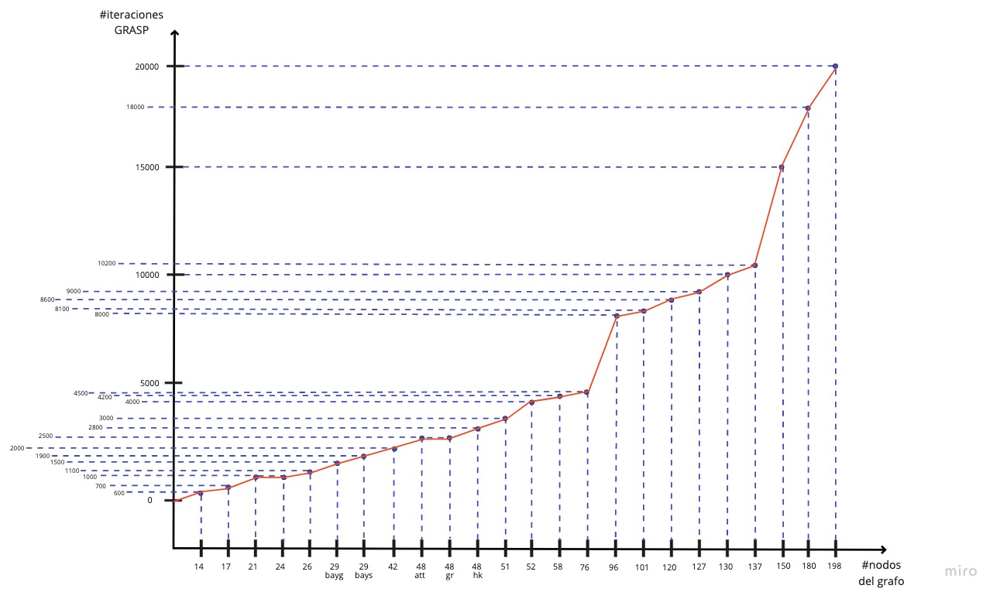

# ALGORITMOS - Trabajo Practico Final

## Preparar entorno

- Instalar las dependencias: 
```
$ npm install
```
- En el archivo main hay ejemplo de utilizacion de las funciones, para correrlas:
```
$ node main.js
```

## Metaheuristica: GRASP

### Enunciado

1. Proponer un algoritmo goloso para el problema del viajante de comercio.

La heuristica golosa propuesta es: **el vertice más cercano**.

2. Aleatorizar el algoritmo anterior.

Se eligira de forma **aleatoria entre los primeros 5 vertices** (o menos) ordenados por cercania.
En este caso, para las pruebas se utilizo un porcentaje de 20% de la lista ordenada como nodo por donde continuar.

3. Proponer un algoritmo de búsqueda local para el problema del viajante de comercio.

Como **operador local** se utilizara el **intercambio de consecutivos**.

4. Variar parámetros y la estrategia del algoritmo de búsqueda local que optimicen el funcionamiento del mismo.

En las pruebas realizadas se utilizan parametros como los siguientes:
- cantidadIteracionesBL: son la cantidad de vecinos que se van a buscar por vecindario.
- porcentajeMinimaDeMejoraBL: es el porcentaje minimo que se va a tener en cuenta para continuar la busqueda.

5. Construir un algoritmo GRASP para el problema del viajante de comercio. La entrada de su algoritmo será un
archivo con una instancia del problema del viajante de comercio (ej: matriz de distancias), y la salida deberá ser
un archivo de texto plano con un circuito hamiltoniano y su valor.

Este algoritmo recibe varias configuraciones aparte de la matriz de adjacencia.
- grafo: como se extrajeron los datos xml se hizo uso de una clase llamada: *GraphXML*, la cual ofrece unos metodos comodos para el manejo de estos datos.
- iteracionesMaximas: cantidad de iteraciones GRASP, en las pruebas se utilizo *(#cantidadNodos * 200)*.
- printCadaTantasIteraciones: numero referencia para hacer los prints, en las pruebas se utilizo *(#cantidadNodos * 2)*,
- aleatorizacionDeHeuristica: *nombrado en puntos anteriores*
- cantidadIteracionesBL: *nombrado en puntos anteriores*
- porcentajeMinimaDeMejoraBL: *nombrado en puntos anteriores*

6. Presentar un gráco de scoring contra la cantidad de iteraciones para baterías de distintas instancias, que permita
decidir una cantidad de iteraciones que ayude a encontrar un valor cercano al óptimo sin desperdiciar tiempo de
cómputo.


